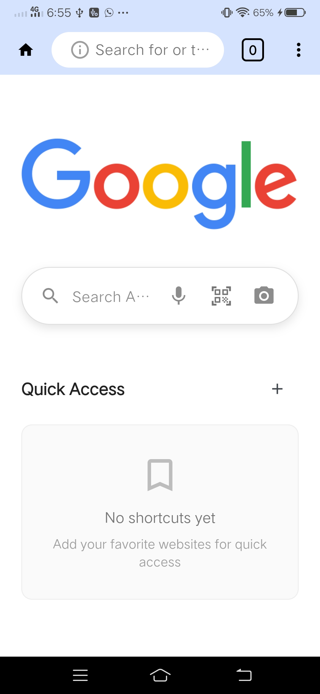
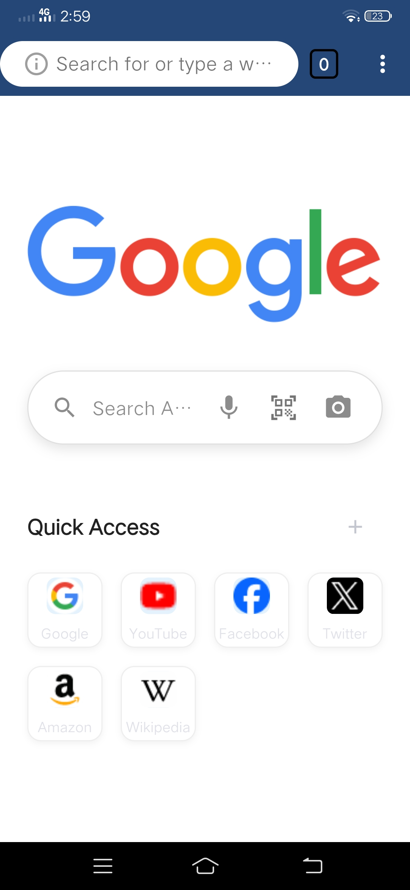
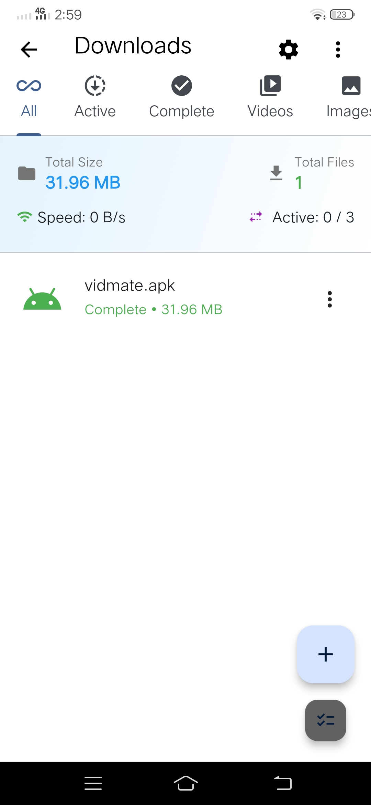
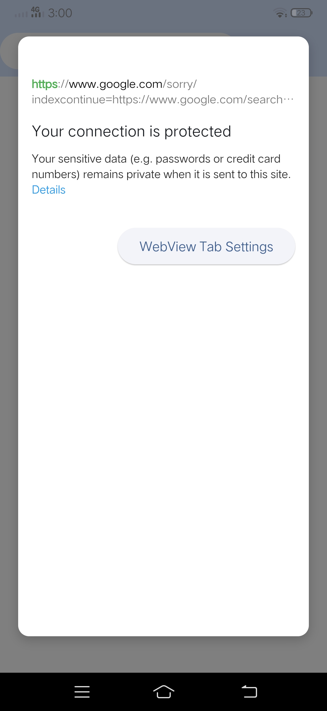
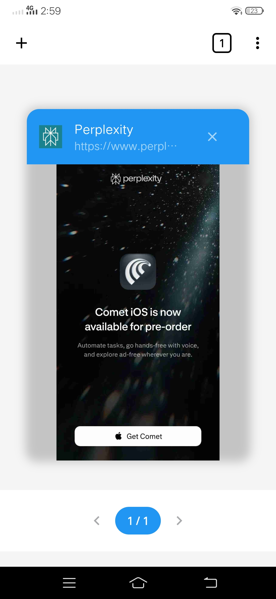
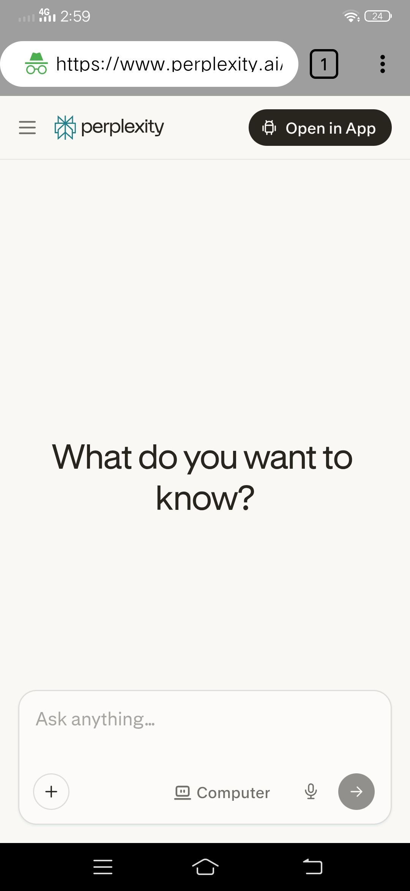
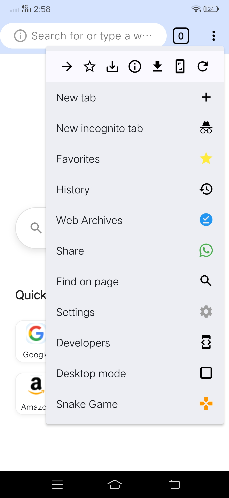

# 🌐 ZBrowser — Flutter Web Browser

A full-featured, privacy-focused **web browser** built with Flutter. Browse any website, block ads, manage bookmarks, track history, and download files — all stored locally on your device with no backend or cloud dependency. Runs on iOS, Android, Web, and Desktop.

---

## 📱 App Overview

ZBrowser is a complete web browser experience built from the ground up in Flutter. It gives users full control over their browsing — load any URL, block unwanted ads, save bookmarks, revisit history, and manage downloads — all without any data leaving the device.

---

## 📸 Screenshots


>   
>   
>   
>   
>   
>   
>   
>   
>   


> </p>
> ```

---

## ✨ Features

### 🔍 Full Web Browsing
- Load any URL or search directly from the address bar
- Forward, back, reload, and stop navigation controls
- Progress indicator while pages are loading
- Support for multiple tabs
- Desktop and mobile website rendering

### 🚫 Ad Blocker & Privacy
- Built-in ad blocker to filter unwanted content
- Blocks trackers and intrusive scripts
- Private / Incognito mode — no history or cookies saved
- Clear browsing data (cache, cookies, history) on demand

### 🔖 Bookmarks
- Save any page as a bookmark with one tap
- View and manage all saved bookmarks
- Edit or delete bookmarks
- Quick access from the home screen

### 🕓 Browsing History
- Automatically records visited pages with timestamps
- Search through history
- Delete individual entries or clear all history

### 📥 Downloads
- Download files directly from any webpage
- View all downloaded files in the downloads manager
- Open or share downloaded files from within the app

### 🎨 UI & UX
- Clean, minimal browser interface
- Dark Mode & Light Mode support
- Customizable homepage
- Smooth animations and responsive layout

---

## 🛠️ Tech Stack

| Technology | Purpose |
|---|---|
| Flutter | Cross-platform UI framework |
| Dart | Programming language |
| flutter_inappwebview | Core WebView for rendering web pages |
| shared_preferences | Storing bookmarks, history & settings locally |
| path_provider | Accessing local file system for downloads |
| open_filex | Opening downloaded files |
| permission_handler | Runtime permissions (storage, etc.) |

---

## 📁 Project Structure

```
lib/
├── screens/
│   ├── browser_screen.dart         # Main browser with address bar & WebView
│   ├── bookmarks_screen.dart       # View & manage bookmarks
│   ├── history_screen.dart         # Browsing history
│   ├── downloads_screen.dart       # Downloaded files manager
│   └── settings_screen.dart        # App settings & privacy options
├── services/
│   ├── bookmark_service.dart       # Save/load/delete bookmarks
│   ├── history_service.dart        # Record & retrieve history
│   ├── download_service.dart       # File download management
│   └── adblocker_service.dart      # Ad & tracker blocking logic
├── models/
│   ├── bookmark_model.dart
│   ├── history_model.dart
│   └── download_model.dart
├── widgets/                        # Reusable UI components
│   ├── address_bar.dart
│   ├── browser_controls.dart
│   └── tab_bar.dart
└── main.dart
```

---

## 🚀 Getting Started

### Prerequisites

- [Flutter SDK](https://docs.flutter.dev/get-started/install) ≥ 3.0.0
- For Android: Android Studio
- For iOS: Xcode
- For Desktop: respective platform build tools

### 1. Clone the Repository

```bash
git clone https://github.com/Abd-ul-Hannan/Zbroswer.git
cd Zbroswer
```

### 2. Install Dependencies

```bash
flutter pub get
```

### 3. Run the App

```bash
# Android
flutter run -d android

# iOS
flutter run -d ios

# Web
flutter run -d chrome

# Windows
flutter run -d windows

# macOS
flutter run -d macos

# Linux
flutter run -d linux
```

---

## 📖 How to Use

### Browsing the Web
1. Open the app — you'll land on the home screen
2. Tap the **address bar** at the top
3. Type a URL (e.g. `https://google.com`) or a search query
4. Press **Go** — the page loads in the WebView
5. Use the **back**, **forward**, and **reload** buttons to navigate

### Bookmarking a Page
1. While on any page, tap the **bookmark icon** in the toolbar
2. The page is saved instantly to your bookmarks
3. Access all bookmarks from the **Bookmarks** tab

### Viewing History
1. Tap the **History** icon or menu
2. Browse your full list of visited pages with timestamps
3. Tap any entry to revisit — or delete entries you don't need

### Managing Downloads
1. Tap a download link on any webpage
2. The file is saved to your device automatically
3. Open the **Downloads** tab to find, open, or share your files

### Ad Blocker & Privacy
1. Go to **Settings**
2. Toggle **Ad Blocker** on/off
3. Enable **Private Mode** to browse without saving history or cookies
4. Use **Clear Data** to wipe cache, cookies, and history at any time

---

## 🔐 Permissions Required

| Permission | Platform | Reason |
|---|---|---|
| Internet | All | Loading web pages |
| Storage (Read/Write) | Android | Saving downloaded files |
| Photo Library | iOS | Saving downloaded media |

All permissions are requested automatically when needed.

---

## 📋 Requirements

- Flutter SDK: `>=3.0.0 <4.0.0`
- Android: API level 21 (Android 5.0) or higher
- iOS: 12.0 or higher
- Desktop: Windows 10+, macOS 10.14+, or Ubuntu 18.04+

---

## 🚀 Planned Features

- Multiple tabs with tab switcher
- Password manager / autofill
- Custom ad block filter lists
- Download queue with progress tracking
- Sync bookmarks across devices
- PWA (Progressive Web App) support

---

## 📄 License

This project is open source. See the [LICENSE](LICENSE) file for details.

---

## 👤 Author

**Abd-ul-Hannan**  
GitHub: [@Abd-ul-Hannan](https://github.com/Abd-ul-Hannan)

---

> Built with ❤️ using Flutter
